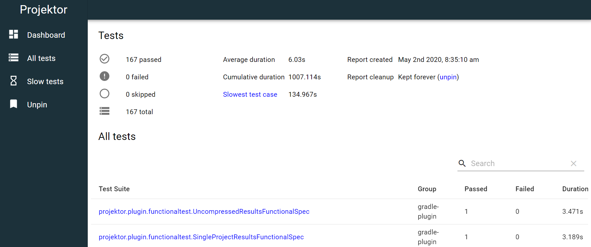

# Projektor GitHub action

GitHub Action for publishing test results to [Projektor](https://projektor.dev/) for viewing in the Projektor UI.
Great for easily viewing your test results when running in a headless CI environment like GitHub actions.



For example, if you're running Cypress tests in CI it can make debugging faster if you can view the screenshots and/or videos when the tests fail:

https://projektorlive.herokuapp.com/tests/GLEXL69S81BW
https://projektorlive.herokuapp.com/tests/GLEXL69S81BW/attachments

Or if you just want to view all the results from your test suite:

https://projektorlive.herokuapp.com/tests/KONCH3QEONFY/

## Example usage

### Using a config file

For detailed list of all parameters that can be specified in the Projektor config file, please see https://projektor.dev/docs/node-script/

```
uses: craigatk/projektor-action@v3
with:
  config-file: projektor.json
```

### Specifying individual parameters

```
uses: craigatk/projektor-action@v3
with:
  server-url: <Projektor-server-url>
  results: test-results/*.xml
```
